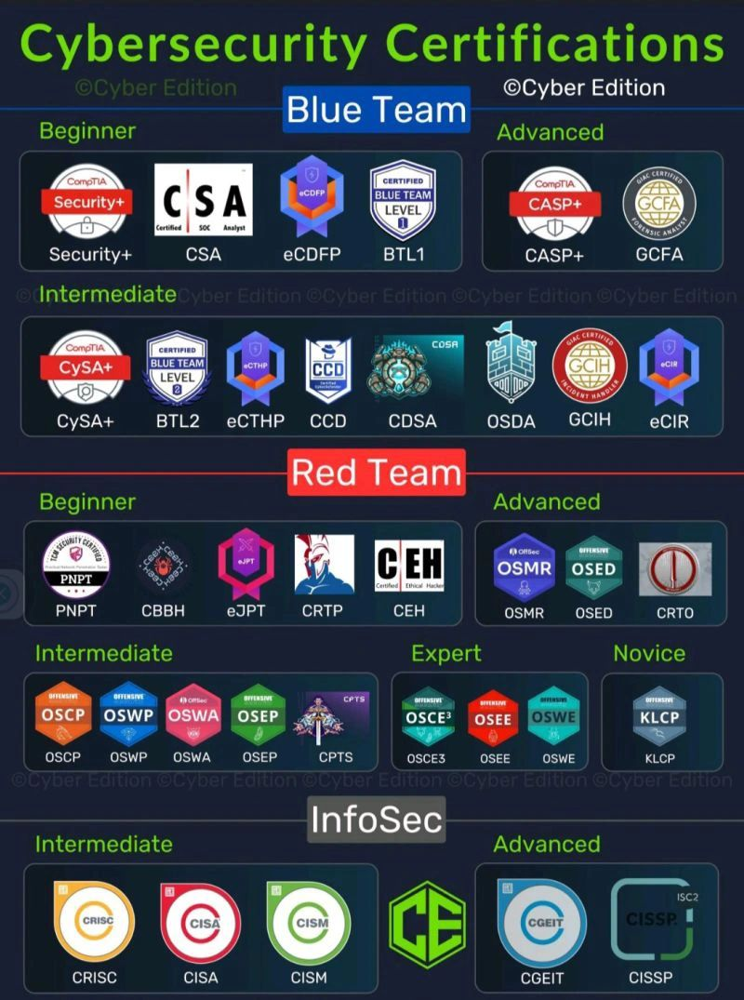

# Getting started

Have you ever wondered where to begin when starting a career or shifting to a new path? I've been there too. I'll outline the routes that helped me advance in cybersecurity, as well as other tech careers you can explore. I'll also highlight paths for those interested in cloud computing with Microsoft, Google Cloud Platform, and AWS—plus blockchain technology.

# **Cyber Security**

While there are numerous certifications available for various cybersecurity roles, it's crucial to first acquire the fundamental skills necessary for entering the field. These basics include networking, understanding different operating systems (such as Windows and Unix-based systems), and computing essentials. I'll provide resources for learning these foundational skills. Below, you'll find a simple roadmap of certifications that can help you enter the job market. However, it's important to note that certifications themselves are not as crucial as the skills gained while pursuing them.

### learn Linux fundamental
    
* [x] [Overthewire bandit war games](https://overthewire.org/wargames/bandit/)
    
### Learn Windows Fundamentals

* [x] [Underthewire war games for powershelll mastery](https://underthewire.tech/)
    
### Web Fundamentals

* [x] [Overthewire Natas challenge](https://overthewire.org/wargames/natas/)
    
    
### Networks

* [x] [CISCO’s Networking Basics course](https://www.netacad.com/courses/networking-basics?courseLang=en-US)
    

## Intro to Capture The Flag

There are many ways to enter the cybersecurity field, and one effective approach is participating in various Capture The Flag (CTF) competitions. CTFs come in different formats, including jeopardy-style and attack-and-defend. In this section, we'll focus primarily on jeopardy-style CTFs, which feature challenges from diverse categories such as web, forensics, miscellaneous, crypto, reverse engineering, malware analysis, and OSINT (Open Source Intelligence).

Importantly, beyond solving challenges, participants are often required to create write-ups in blog format. This practice not only hones technical skills but also develops the crucial ability to document findings effectively. Such documentation skills are highly valued in the industry, as they enable professionals to produce comprehensive reports for organizations to assess and evaluate their security posture.

Below are more platforms that one can practice and participate in CTF
    
* [x] [picoCTF](https://picoctf.org/)
    
* [x] [CyberTalents – A Global Platform For Cybersecurity Talents](https://cybertalents.com/)
    
* [x] [letsDefend](https://letsdefend.io/)
    
* [x] [CTFROOM](https://www.ctfroom.com/home/)
    
* [x] [cyberranges](https://www.cyberranges.com/)

* [x] [Sofia Santos | OSINT and analysis exercise](https://gralhix.com/list-of-osint-exercises/)

* [x] [Vulnhub](https://www.vulnhub.com/)

* [x] [Pwn College](https://pwn.college/)

* [x] [Hack this site](https://www.hackthissite.org/)

:zap: The above list is not fully exhausted as there are more platforms out there.    

# **Cloud computing**

Many cloud providers offer certifications to familiarize users with their technologies, including Microsoft, AWS, and GCP (Google Cloud Platform). Additionally, there are platforms that provide CTF-like labs where individuals can practice their cloud computing skills. In this section, we'll outline roadmaps to help you break into AWS, GCP, and Microsoft Azure.

* [x] Microsoft azure
    
    As seen below are the certifications that one requires to become azure cloud practitioner.
    
    
    
    
    
* [x] Google Cloud Platform
    
    As seen below  are the certifications that one requires to become google cloud certified practitioner.
    
    
    
* [x] AWS
    
    As seen below is a chart highlighting the certifications one is required to have in order to become an AWS cloud practitioner. However, the are CTF-like labs where one can put their skills to the test, these platforms are such as
    
    * [x]  [Cloudgoat](https://github.com/RhinoSecurityLabs/cloudgoat)
    * [x]  [aws Flaws](http://flaws.cloud/)
    
    
    

Beyond obtaining certifications, it's crucial to continuously practice and hone your skills. This practice helps you stay up-to-date with the latest security issues arising from cloud misconfigurations—vulnerabilities that attackers exploit to access organizational resources. Here are some labs where you can actively learn new skills and develop strategies to counter potential attacks:

* [x] [PwnedLabs](https://pwnedlabs.io/)

# **Block Chain**

As the world embraces cryptocurrency, Blockchain technologies are growing rapidly. This swift expansion has led more individuals to explore the field, eager to understand the buzz surrounding Blockchain technology. The best platform I continue to learn from is Cyfrin Updraft, a free hands-on course where learners gain knowledge through practical projects. By the end of the course, participants emerge not only with knowledge and skills but also with a completed project—tangible proof of their work.

* [x] [Home | Cyfrin Updraft](https://updraft.cyfrin.io/)