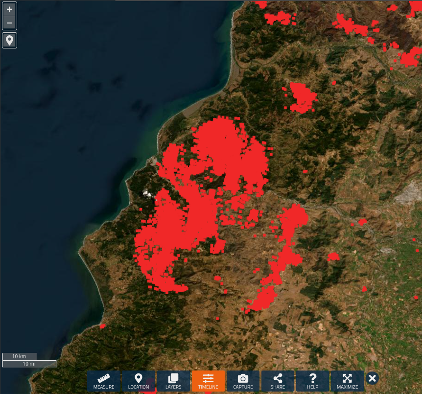
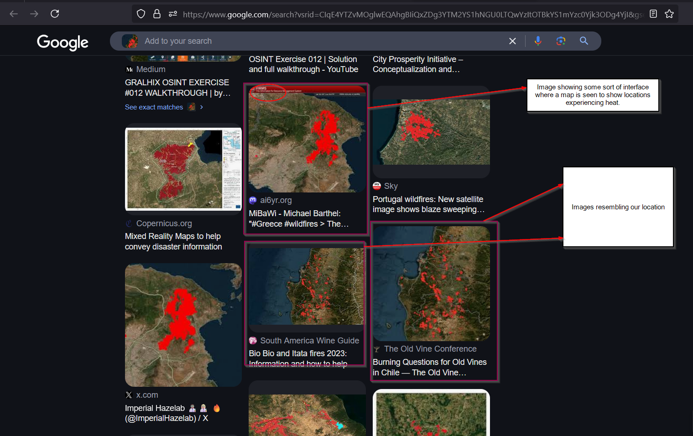

# Exercise 12

This challenge was a medium one for me, playing around with reverse image search and searching for the heat map. Below is the task briefing.

```bash
The screenshot below shows satellite imagery from a coastal area. Each 
red pixel represents a 30 metre centre point containing a thermal 
anomaly. The data is from January.
Please analyse the screenshot and answer the following questions:

a) Which website was used to produce the image below?
b) Which is the country seen in the image?
c) The screenshot shows data from a specific date. Which is the date?
```



## Which website was used to produce the image

For this section I did a reverse image search as shown below and was able to find the site after verifying the resemblance of the site and the image above.



Clicking on the [link](https://m.ai6yr.org/@MiBaWi/112950044410698772), we are redirected to this site shown below.


and from the site their is a post made that shows FIRMS(Fire information for Resource Management System), searching online for the site we find the following results.


Clicking on the second link, I got some interesting information where by I had to put the site on another window along side the challenge image and analyzed the two and some identifiers from the challenge image verified this [site](https://firms.modaps.eosdis.nasa.gov/map/#d:24hrs;@0.0,0.0,3.0z) to be the one where the screenshot was taken from as shown below.


`Answer: [NASA FIRMS](https://firms.modaps.eosdis.nasa.gov/map/#d:24hrs;@0.0,0.0,3.0z)`

## Which is the country seen in the image

From the previous question we have solve, when we were doing reverse image search, we found information that resembled our image as shown below.


To confirm if the findings were true, I had to place the images along side each other and verify our findings to be true as shown below(I used the one indicated ‘The Old Vine Conference)


The two images were not looking similar but since we are searching for the country I decided to start with Chile that is indicated in the blog site we found for the old vine conference to look at the coastal borders, moreover, the coastal region seems to be bordering a water body to the west.


As seen above after searching for the country Chile on NASA FIRMS’ site and looking at the coastal region, I found a region that resembles our image as shown above.

`Answer: Chile`

## The screenshot shows data from a specific date. Which is the date?

For this section I had to go back to the task briefing, we are told `The data is from January` using this data I searched on google fire in Chile that happened in January as shown below.


It appears Chile experienced wild fires on `January 2017` with this we can go back to NASA FIRMS and tweak the dates to find the exact date, as shown below after some tweaking we got the exact date.


`Answer: January 26,2017` 

With that we have solved our entire challenge.