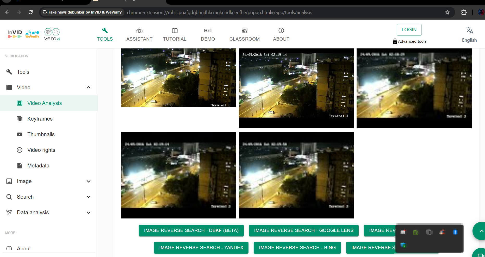

# Exercise 14

For this challenge we are required to find the magnitude of the earthquake and the coordinates of the camera used to record the place as described in the briefing below.

```bash
The video below was recorded during an earthquake.
Please find the answer to the following questions:

a) What was the magnitude of this earthquake?
b) What are the coordinates of where the camera was likely located in order to record this scene?
```

link to the video is [here](https://youtu.be/myTG1LpMN7g).

## What was the magnitude of this earthquake

For this question, we shall first start by identifying the location on the video. Just like reverse image search there are tools used to do reverse video search, we need to do a reverse image search to see if the video was only from Sofia Santos or someone else.

The tool we shall use for this task is called [InViD](https://chromewebstore.google.com/detail/fake-news-debunker-by-inv/mhccpoafgdgbhnjfhkcmgknndkeenfhe?hl=en), where we shall upload the video link to it and it will generate images that we can ten do a reverse image search of them as shown below.



As seen above snapshots of the video were taken and through the tool we can do a reverse image search of the photos. 


As seen above we have a youtube [link](https://www.youtube.com/watch?v=aPIpBdgwD94) of the same place,however the video caption says it was 2018 and from the cctv photo-age it is dated 2016 but we have some information from the youtube video of the place which is `Bucharest,Romania` as shown below,.


We can search on google to see the magnitude of the earthquake of 2016 in Romania.


From our search we get a magnitude of 5.6.


Let’s search for the government announcement of Romania concerning the earthquake and see if he magnitudes are the same but I was unable to find some concrete information. However, going back to the youtube video we found earlier of our challenge video and looking at the comments someone has commented that there are rarely earthquakes in Romania.

Searching if there were earthquakes experienced by countries bordering Romania, I found some interesting information on [Moldova country](https://www.moldova.org/en/53-degrees-night-earthquake-romania-strongly-hit-moldova/) as shown below.


`Answer: 5.8`

## What are the coordinates of where the camera was likely located in order to record this scene?

For this section we shall go back to our video and try to identify some features as shown below.


With this findings, I searched for malls first in Romania and see if I can find anything related to my images above, however, this path was tiresome, I therefore went back and did a reverse image search with yandex from the video reverse search we did earlier and found this particular image.


Going to the link, I found the exact [video](https://www.youtube.com/watch?v=lvGpouFqmJ0) of the event as shown below.


Translating the video caption name, I got the following.


`Earthquake Chisinau` now I can further crop the image to this particular buildling and search for it in chisinau as shown below.


We have been able to find the building atrium shopping mall and where it is located, Moldova near Bic river.


Building from google earth pro.

We can now try to pin point where the camera was.


Below is an image showing the coordinates.


`Answer: 47°00'57.6"N 28°51'14.1"E`