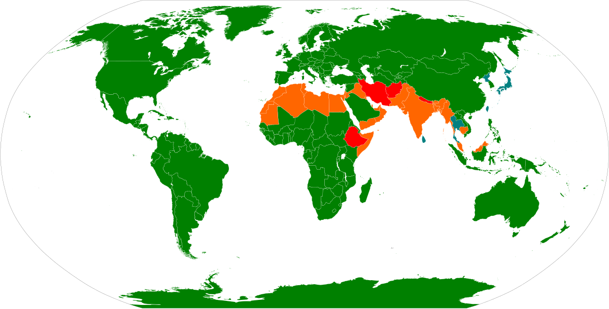
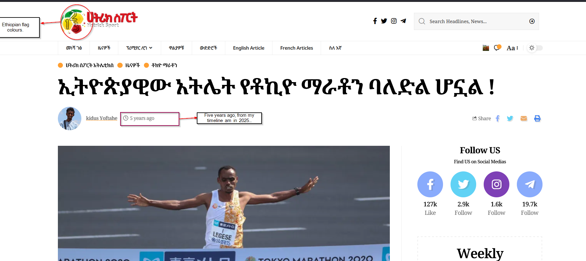

# Exercise 17

For this [challenge](https://gralhix.com/list-of-osint-exercises/osint-exercise-017/) we are required to find the dates when the blogs were posted, however, the date on the blogs are not normal dates as said in the task briefing below.

```jsx
The majority of countries around the globe use the Gregorian 
calendar. However, there are other systems to measure and organise time.
Below you will find three news articles from countries that have not 
adopted the Gregorian calendar.

Your task is to find out when the articles were published, according to the Gregorian calendar.
  1. “ኢትዮጵያዊው አትሌት የቶኪዮ ማራቶን ባለድል ሆኗል !” 
  2. “प्रहरीमा ५ हजार ४४४ जनाका लागि भर्ना खुल्यो”
  3. “در پنجمین شب جشنواره موسیقی فجر کدام گروه‌ها پا به صحنه می‌گذارند؟”
```

”The **Gregorian calendar** is the [calendar](https://en.wikipedia.org/wiki/Calendar) used in most parts of the world. It went into effect in October 1582 following the [papal bull](https://en.wikipedia.org/wiki/Papal_bull) [*Inter gravissimas*](https://en.wikipedia.org/wiki/Inter_gravissimas) issued by [Pope Gregory XIII](https://en.wikipedia.org/wiki/Pope_Gregory_XIII), which introduced it as a modification of, and replacement for, the [Julian calendar](https://en.wikipedia.org/wiki/Julian_calendar). The principal change was to space [leap years](https://en.wikipedia.org/wiki/Leap_year) differently so as to make the average calendar year 365.2425 days long, more closely approximating the 365.2422-day ["tropical" or "solar" year](https://en.wikipedia.org/wiki/Tropical_year) that is determined by the Earth's revolution around the Sun.” According to wikipedia

We can be able to view countries that use the gregorian calendar from this [link](https://commons.wikimedia.org/wiki/File:Calendars_world_map.svg).



With that small introduction we can now find the dates when the blogs were published.

## “ኢትዮጵያዊው አትሌት የቶኪዮ ማራቶን ባለድል ሆኗል !”(`"Ethiopian athlete wins Tokyo Marathon!"`)

We have been provided with a [link to the article](https://www.hatricksport.net/%e1%8a%a2%e1%89%b5%e1%8b%ae%e1%8c%b5%e1%8b%ab%e1%8b%8a%e1%8b%8d-%e1%8a%a0%e1%89%b5%e1%88%8c%e1%89%b5-%e1%8b%a8%e1%89%b6%e1%8a%aa%e1%8b%ae-%e1%88%9b%e1%88%ab%e1%89%b6%e1%8a%95-%e1%89%a3%e1%88%88/), we can navigate to the link and see how the article looks like as shown below.



Since I know how the Ethiopian flag looks like, I clearly knew the post was made in amharic language and the post was made in 2020, we can now translate the page to English and read what it is about.


Interesting, analyzing the image further, it seems the marathoner won the tokyo 2020 marathon. To find more information, I inspected the source code to see if we will find information on when the post was published as shown below.


From the source code it was published on `March 1, 2020` , we can search further to see if this post was truly published on this date.


Look what we found, the same image as the one from the article, following the link we can clearly see the winner is the same person as from the article and it was on `March 1, 2020` 

`Answer: March 1, 2020` 

## “प्रहरीमा ५ हजार ४४४ जनाका लागि भर्ना खुल्यो”(`"Police recruitment opens for 5,444 people"`)

The [link to the article](https://www.onlinekhabar.com/2016/01/381827) directs us to this page shown below.


at first I did not know the language but after translating the page I found it was in nepalese as shown below.


Although the post had a date when it was published, the date was still looking weird to me as shown below.


At First even translating the page,I was not able to get the time shown above which seems to be the tag for when the post was made but transalting the page to its original language and using google translate, I was able to find the date as shown below.


`2072`, it seems we are in a different earth as in flash series, we are in some earth 12 or something 😅. Anyway, from the translated data, we have some useful information the month `magh` ,year `2072` and day `17` we can use a calendar [converter](https://www.hamropatro.com/date-converter) for nepalese calendar and see what day it was as shown below.


Before conversion.


After conversion, we get our date `January 31, 2016`

`Answer: January 31, 2016` 

## “در پنجمین شب جشنواره موسیقی فجر کدام گروه‌ها پا به صحنه می‌گذارند؟”(`“Which bands will take the stage on the fifth night of the Fajr Music Festival?”`)

For this one as well we have the [link to the article](https://www.yjc.ir/fa/news/8369785/%D8%AF%D8%B1-%D9%BE%D9%86%D8%AC%D9%85%DB%8C%D9%86-%D8%B4%D8%A8-%D8%AC%D8%B4%D9%86%D9%88%D8%A7%D8%B1%D9%87-%D9%85%D9%88%D8%B3%DB%8C%D9%82%DB%8C-%D9%81%D8%AC%D8%B1-%DA%A9%D8%AF%D8%A7%D9%85-%DA%AF%D8%B1%D9%88%D9%87%E2%80%8C%D9%87%D8%A7-%D9%BE%D8%A7-%D8%A8%D9%87-%D8%B5%D8%AD%D9%86%D9%87-%D9%85%DB%8C%E2%80%8C%DA%AF%D8%B0%D8%A7%D8%B1%D9%86%D8%AF) provided to us just like the other articles. Navigating to the article we are met with a page written in Persian language as from the translation of the article title.


Translating the page, we get to see the published date as shown below.


`esfand` to me looks like we have a month but with this small translation, it is not enough information for us to use, I decided to translate the date back to its original language and use google translate to convert the date alone and see what we get as shown below.


`March 2, 1401` with this translation we can now say we have the year `1401`, and day `2` as the month we earlier got it to be `Esfand` as some times google translate may mistranslate some words, furthermore, going through the blog this was a musical festival conducted in more than one day as shown below.


Now we can use the data (`Esfand 2 1401`) we have gathered about the date when the post was made and look for a Persian calendar translator to give us the date when the post was made. I found this [translator](https://www.iranchamber.com/calendar/converter/iranian_calendar_converter.php) online.


After translating our date, we got the day as shown above `February 21, 2023` 

`Answer: February 21, 2023`

# Lessons learned

From this OSINT challenges, I was able to learn an important skill in OSINT, `DO NOT ASSUME` as for each challenge I inspected the source codes for the times of publication for each post but had to do more research online to verify if the dates were truly correct.