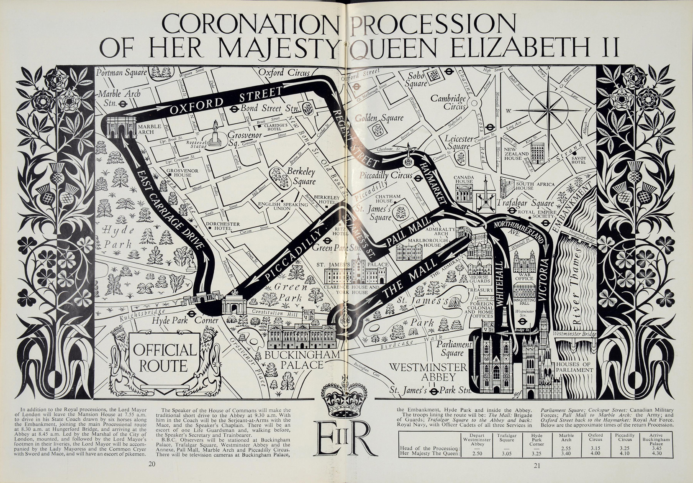

# Exercise 18

For this [challenge](https://gralhix.com/list-of-osint-exercises/osint-exercise-018/) we are required to find the details described in the task briefing as shown below.
```
In May 2023, the world witnessed the coronation of King Charles III at Westminster Abbey in London. Following the ceremony, and similarly to the previous regent, the monarch travelled through the city in a lavish carriage. The route of the 2023 royal procession differed from that of 1953.

Your task is to:  
a) Identify from which exact door Queen Elizabeth II left Westminster Abbey after her coronation.  
b) Measure the distance travelled by the Queen’s carriage, following the 1953 coronation.  
c) Estimate the average speed at which the Queen’s carriage travelled.
```

## Identify from which exact door Queen Elizabeth II left Westminster Abbey after her coronation.

For this section we shall first start by searching for the coronation celebration of 1953 on youtube, as the event was witnessed world wide, a video of the celebration can not miss as it was streamed.

From the video identified above, I was able to locate a scene where we see the queen leaving the Westminster abbey as shown below.

From the video we have been able to identify from which door she left but still there is no enough information for us to use to identify the exact door as the Westminster abbey contains many doors that leave the vicinity as shown below from google earth pro.

However doing further research on youtube I found another video that is a bit old but we can clearly see the queen entering the vicinity through the same door as shown below.

Watching the video further, we get a glimpse of some features we can use to identify from which side the queen left the vicinity as shown below.

After ananlysis, I was able to identify the pattern on the video on the building as shown below.

We can now clearly identify which door it was as shown below.


`Answer: 51°29'58.10"N, 0° 7'42.52"W`

## Measure the distance travelled by the Queen’s carriage, following the 1953 coronation
For this section, I had to search for the coronation walk that the queen did in order to find the streets she passed through and use them to measure distance on google earth pro.

From the above image, following the [link](https://www.nationalarchives.gov.uk/education/resources/significant-events/coronation-of-elizabeth-ii-1953/) ,we get to this page that has a map of the streets and how she passed through them towards the Buckingham palace as shown below.



Using this map we can now map the landmarks where turns were made and use them to measure the distance.

Form the image above, we can see clearly the path followed by the queen the distance covered I got it to be as shown below in kilometers and miles.


`7.89 kilometers`


`4.90 miles`

However, searching for the actual distance covered during the return to the palace form the Westminster abbey I got it to be 5 miles and 8.2 kilometers


Following the link identified by AI, I got this [page](https://storymaps.arcgis.com/stories/af1e1b457b9040bb8a8c8131bc577dda) that details how the queen travelled back to the palace and the distance covered as shown below.

Hence the distance covered was 5 miles(8.2 kilometers)

`Answer: 5miles(8.2 kilometers)`

## Estimate the average speed at which the Queen’s carriage travelled
From the [page](https://www.nationalarchives.gov.uk/education/resources/significant-events/coronation-of-elizabeth-ii-1953/) we found initially containing the routes the queen covered back to the palace also had details about the time she arrived at each spot as shown below.

From this time table we can calculate the time taken to arrive at the palace by finding the difference between arrival and departure times using this online [calculator](https://www.calculator.net/time-duration-calculator.html) as shown below.

From the calculator we have found the time difference in different time formats from hours to seconds. Now to calculate the speed we can do it in two ways `miles per hour or kilometers per hour`  that is dividing the distance covered by time taken (Speed=distance/time) using this online [calculator](https://www.calculator.net/speed-calculator.html) as shown below.

Speed in miles per hour is 3miless/hour as shown above.

Speed in kilometers per hour is 4.92kilometers/hour.

`Answer: 3 miles/hour or 4.92 kilometers/hour`


