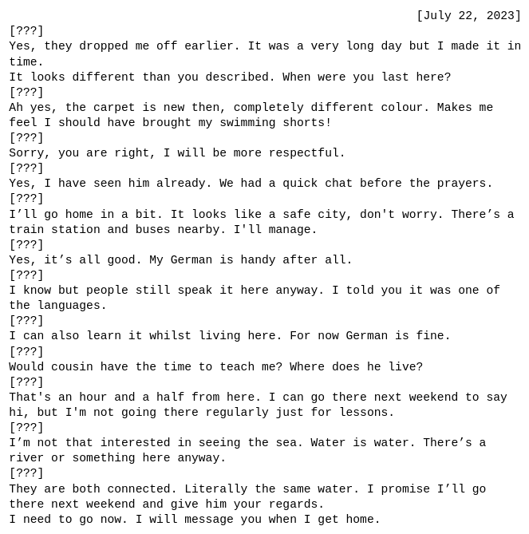

# Exercise 19

For this [challenge](https://gralhix.com/list-of-osint-exercises/osint-exercise-019/)we are provided with a transcript containing communications between two people over phone, however, we can only be able to see one side of the communication. Below is the task briefing.
```
The text below is a partial transcript of a phone call in which you can only read one side of the conversation. Despite the text being completely fabricated for this exercise, the location described is real. Your task is to geolocate where the person was at the time of this fictitious phone call.
```
Below is the transcript that we are required to analyze to find the location of the caller at the time of the call.


From the above transcript, I was able to identify some interesting information that could aid in identifying the location as shown below.


From the above image, we are able to identify some crucial information, the person is in a city which half an hour away to the cousin's place near a sea, hence the country is not land-locked. The country the person is in speaks German as one of its languages hence Germany is out of the picture as German is a national language, the place he visited is a prayer area and from the conversion it seems the place is near a water body that connects with the sea as the person says `The same water` .Furthermore, the city the person is in has buses and train stations nearby.

This found information is sufficient enough for us to search online and find the country.

As seen above from the identified countries, after going through the countries, Belgium stood out for me as it is near a water body unlike the others apart from Germany but Germany was also ruled out as it speaks German as a national language, however, from Belgium I was able to identify three cities as shown below.

`Ghent,Bruges and antwerp`

From this three cities, I checked the three cities with water bodies that are connecting to the large water body and found two to be of interest to me as shown below.

Now on to measuring the distance form the cities to the water bodies, Ghent was close to the described distance in the transcript as shown below.

Now diving to the city and search for prayer centers like mosques I found a number of them in the city as shown below.

One mosque caught my eye, from the transcript the person seemed to be making a joke about carrying their swimming costume and this mosque `Moskee OKBA IBN NAFI` had a blue carpet resembling a water body as shown below

Looking at the mosque Facebook page, it validated our findings as the mosque seemed to be undergoing some renovation as shown below.

Now looking around the area within the mosque on google maps, I was able to identify train tracks and bus stops.

With that information, we can clarify that the location of our caller at the time was at `Moskee OKBA IBN NAFI`

`Answer:Moskee OKBA IBN NAFI`


