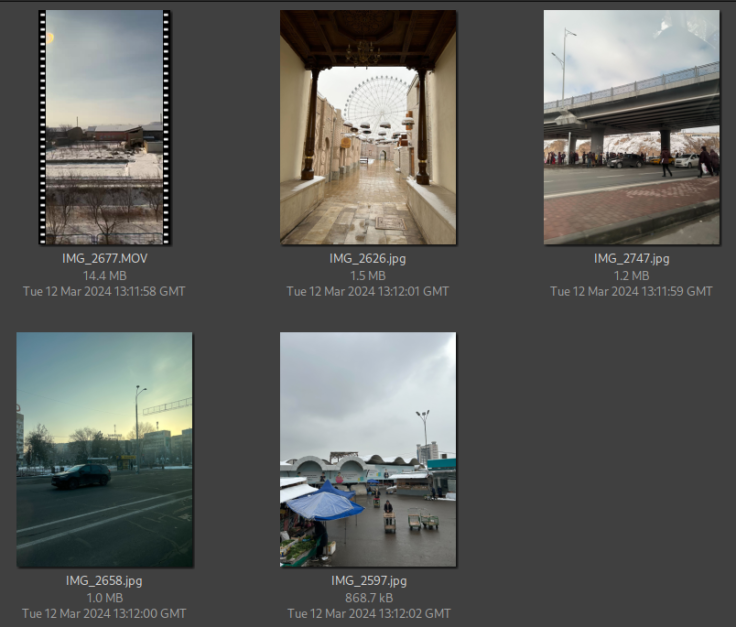
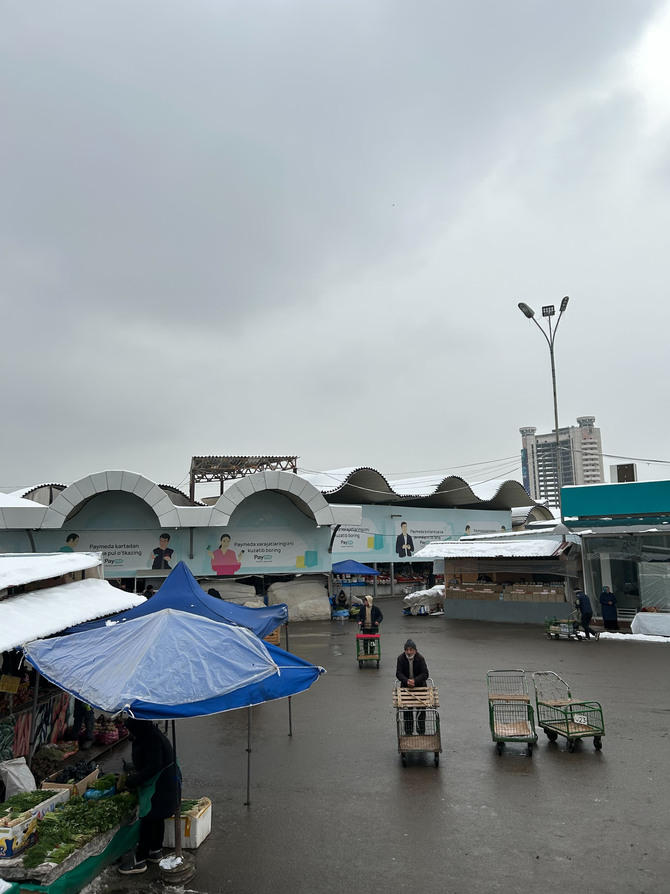
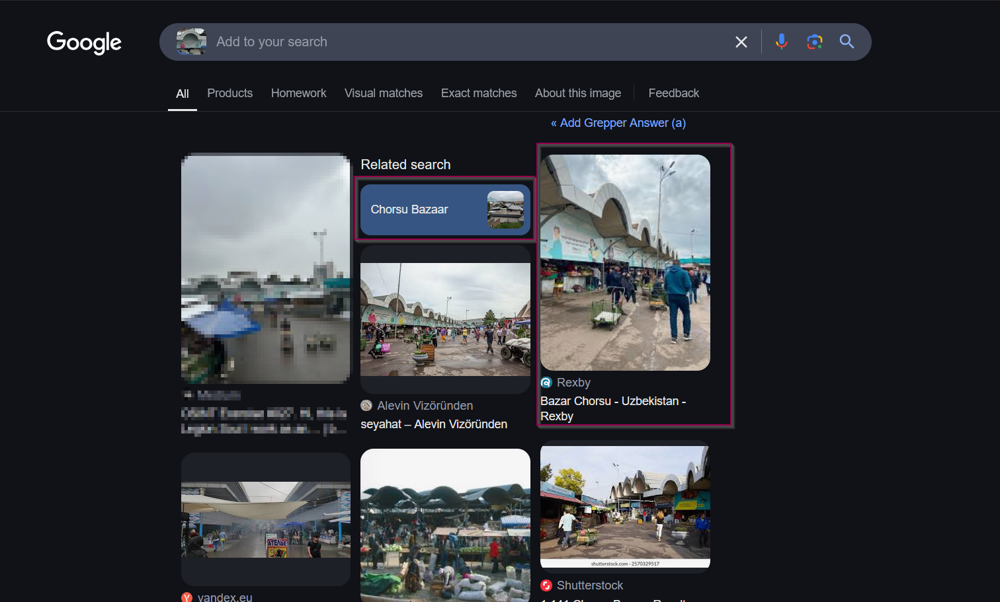
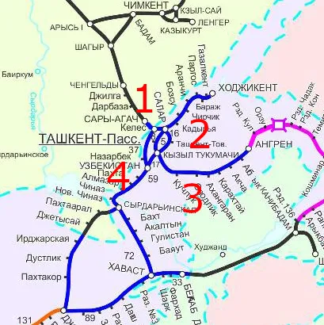
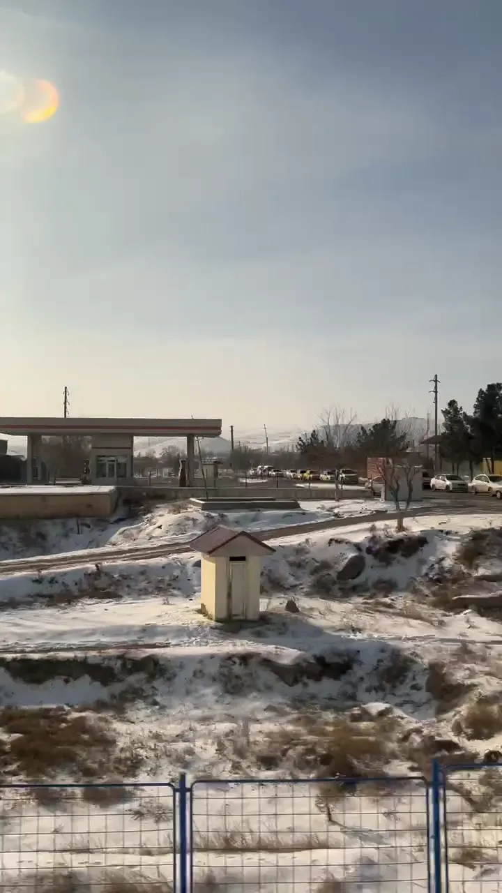
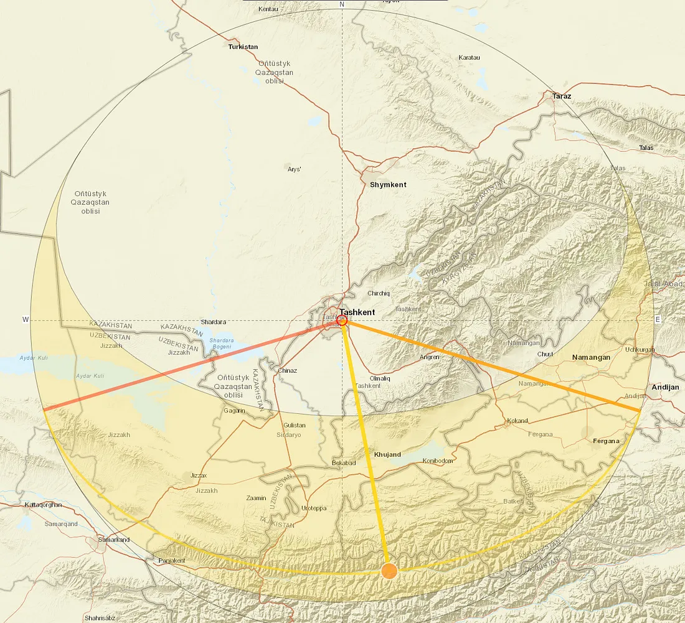
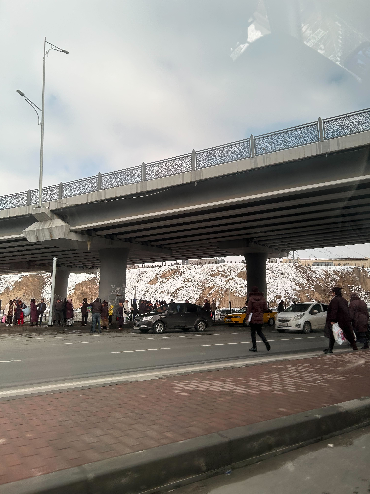
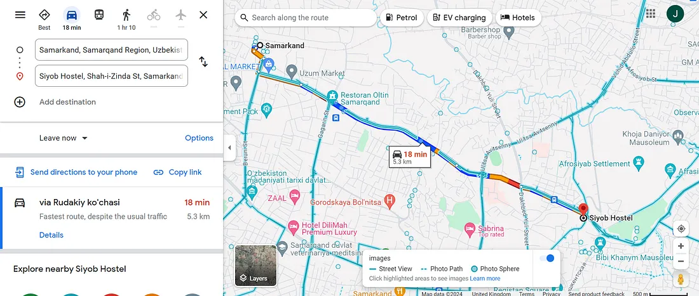

# Exercise 26

For this [challenge](https://gralhix.com/list-of-osint-exercises/osint-exercise-026/) we are provided with a zip folder containing some images and a video, we are required to find the train station the person boarded and alighted from.

```jsx
The image below shows the contents of a zip file.
Inside you will find a 31-second video recorded during a train ride, 
and four photos of undisclosed locations. They were all taken by the 
same individual in February 2024. Despite having no useful metadata, 
they still contain enough information to track down this person’s 
movements.
Your task is to determine:

a) At which train stations did the person board and alight?
```



Here is the link to the [zip file](https://gralhix.com/wp-content/uploads/2024/04/osintexercise026.zip)

Furthermore, the challenge has some bonus questions we can try to answer as shown below.

```jsx
Bonus challenges:
Identify the mode of transportation in each image.
Determine the type of train they rode.
Estimate the speed at which the train was travelling when the footage was recorded.
Calculate approximately how far did the person travel overall.
```

## Photo 1

We shall start with the photo below for our analysis



For this photo we can try by doing an image reverse search to find where this location is from.



As seen above, we have been able to locate the location `Chorsu Bazaar Uzbekistan` we can look at this location on google maps and try identify where this photo was taken from using street view and comparing the image alongside the view.

This approach was quite challenging, we shall first start by analyzing our photo to see what we can identify.


As seen above we have been able to identify some features from the image and furthermore, the person was at a higher ground as the people seen on the image are at a lower place.

We can try and crop the image to find the building we have identified on the image and see where it is located.


We have found our building it is called `Tts "Chorsu"` as seen below on the google maps


With that we have been able to see where the photo was taken from `Chorsu Bazaar Uzbekistan` but we need to verify the location where our person took the photo, we can try and search on earth pro.

We are unable to find any street views in particular to our image but I was able to identify a probable location where our person was by the time of taking the image.


From the image analysis, the person was traveling on foot as this is a busy market place and from where he.she was taking the photo, it seems the person was seated and many shops were not open, it was therefore morning hours, the person could be enjoying a cup of tea or coffee from the shop he or she was. The name of the city was Tashkent.

`Answer: 41°19'34.6"N 69°14'05.8"E, mode of transport: By foot`

## Photo 2

For this section, we shall be looking at this photo.


We can start by an image reverse search just like the previous image.


As seen above, we have been able to find the location `Navruz park, Tashkent Uzbekistan`


As seen above we have located our location, moreover from the image, it was in the morning as there are no shops that area open at the moment. The mode of transport used was on foot.

`Answer: 41°19'34.2"N 69°15'57.8"E ,mode of transport: By foot`

## Photo 3

Our third photo to analyze is as shown below.


Let us try and do it differently, we shall start by analyzing the photo for features we can use to identify the location as shown below.


We have been able to identify two features, we can try a reverse image search and see if we shall find a location with these features. Reverse image search was not sufficient, we shall zoom closer to the image and try find more details.


As seen above, there is a car rental shop near by, since the last two photos we saw, were all in Uzbekistan, we can try and search for car rental shops in Tashkent and see which one has the same match as ours.

After some searched, I was able to find a shop that matches the advert color on the poster of the shop.


We are now close to the location of our image.


As seen above, we are now able to locate where our image was taken from.

From the image the person was on a vehicle, and as the person seems to be traveling a lot, the person is a tourist therefore for this case means of transport could be a taxi.

`Answer: 41°17'57.6"N 69°16'21.1"E, mode of transport: Taxi`

## Video

For this video, we need to think about the context: the images we are analysing seem to be from someone’s camera roll. They are named like a digital camera would name images: incrementally. Thus this video, *IMG_2677*, has been taken after the three images we already localised: *IMG_2597* (Chorsu Bazaar), *IMG_2626* (Halva Café) and *IMG_2658* (Subway entrance). It would stand to reason that the train this person took departed from Tashkent.

If we take a look at a [map of the railways in Uzbekistan](https://railway.uz/upload/iblock/b73/b736cc5a0ba5a820a2e91a6941a9b52d.jpg), there are 4 railways leaving Tashkent:




Looking at the video, we are able to identify some details shown in the image below.



There are mountains in the background with some pattern.


The sun on the image is to the left, that is behind the train, we can check the sun position using [suncalc](https://www.suncalc.org) as shown below.



Position of the sun on February 15th 2024 at 12:01

This suggests that the train was most likely heading southwest, following the fourth railway on our map. The next major stop along this route is Samarkand. When examining this region on Google Earth, only the final third of the journey (highlighted in red below) appears to feature the mountainous terrain visible in the video.


At last now we have a smaller location to search, from here, I looked for the unique patterns we saw on the mountains and found them as shown below.


Moving along the site, I was able to identify a location that has a fuel station and a junction where cars cross the train tracks and found the following location.


From the image above we have been able to identify our location.

`Answer: 40°05'50.9"N 67°48'11.7"E`   

## Photo 4



This photo too we shall first try and analyze it and see features we can use to locate our place, then perform a reverse image search.


After identifying the features, we shall use this details to confirm our location. As from the video, we have found the person was probably heading to `Samarkand` , we can look around this region to see if we can identify any overpasses with these features.

Searching through the region, we are able to get our location a shown below.


`Answer: 39°39'54.0"N 66°58'47.2"E mode of transport: Taxi`

## Train stations and speed traveled

From our analysis from Tashkent, I was able to locate train stations near by. As from the location of where the person was from the market to the picture taken while on a taxi near a bus stop, we can conclude the train station he/she boarded the train from is `Stantsiya Tashkent Pass Tsentr` as shown below.


`Station where the person boarded the train Stantsiya Tashkent Pass Tsentr` 

The location he alighted the train station is  `Samarkand station`.Since now we now the train station the person boarded and alighted from, we can search for the type of trains found in Stantsiya Tashkent Pass Tsentr, where the person boarded the train.


To decide which train was used, I checked the train timetable [here](https://www.advantour.com/uzbekistan/trains/timetable.htm) as shown below.


the train used is therefore `Afrosiyob Train` as it is fast and from the timetable the trips are usually made on a daily basis.

## Speed the train traveled during recording.


As seen above, the distance of the train during the time of recording is `0.19 miles` and the duration was `8 Seconds` ,therefore after calculation, the speed is `85.5 mph` as shown below.


`Answer: 85.5 mph` 

## Total distance covered

As shown below the distance calculated roughly from the market to the Tashkent train station is `7.4 km`


A quick Google search for the train distance between Tashkent and Samarkand yields about five vastly different figures. I opted for what seemed to be the most reliable [source](https://highspeedtrains.com/route/tashkent-to-samarkand), which estimated it at approximately `300 km.`

Finally, the distance from the Samarkand Train Station to the Siyob Hostel—which I assume is the person's accommodation, given its closeness to the approximate viewpoint of the last photo—is:



`5.3km`

Therefore total is approximately distance covered is `312.7 km`