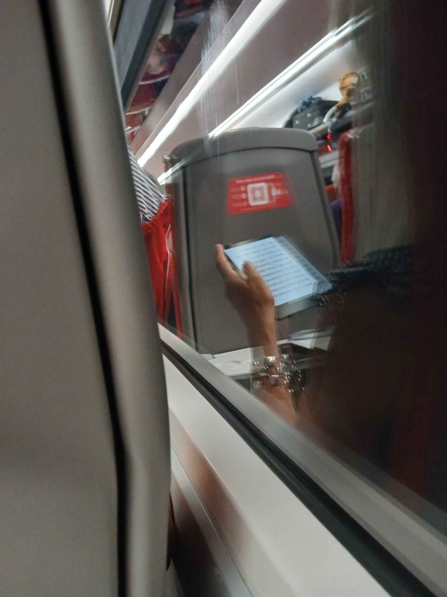
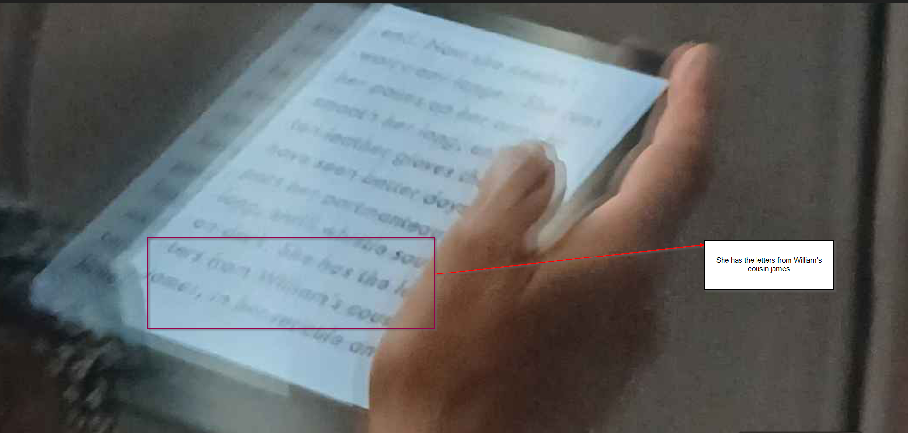

# Exercise 29

This [challenge](https://gralhix.com/list-of-osint-exercises/osint-exercise-029/) was quite a tough one as we are required to know which book the person was reading yet the image from the challenge is too blurry. Below is the task briefing.

```jsx
I took the photo below whilst riding a train in the UK. I always 
prefer quiet areas where no one can sit behind me because, in a public 
space, no information is truly private.

Your task is to:

a) Uncover what the person in front of me was reading.
b) Identify the train model.
c) Identify my seat number.
```

Here is the image we are to use for our investigation.


## Uncover what the person in front of me was reading.

For this section, we shall try and identify few words from the text if they are visible enough for us to read. From the image, it is clearly seen to be a reflection , I will try and turn the image to identify words.



As seen above we have been able to flip the image horizontally, we can try and read the words using the old book technique of squinting(can use this technique if you do not have eye problems).



As seen above we are able to identify few words `She has the letters from William's cousin james` we can search for a book with this words. After some searches online, I came across google’s [advance book search](https://books.google.co.ke/advanced_book_search) that you can use to search a book with specific words, let us try it out and see what we shall find. This route gave me a lot of books to identify, however, since this challenge was solved some time  back with other participants, I tried to search for the words on google using this google dork query `"She has the letters from William's cousin james" book` and got the book as shown below.


and to verify if truly it was the book, I searched for the words we identified and got the words clearly.


`Answer: Sara Sheridan’s book, *The Fair Botanists*.`

## Identify the train model

For this section we shall first start by analyzing the image as shown below.


With this features identified, we can now try and search online for trains in UK with red and grey themed seats with QR code label sticker at the back.


Using the description, I was able to get a [link](https://www.lner.co.uk/support/on-board-faq/on-board-experience/what-is-the-qr-code-at-my-seat/) to LNER trains FAQ page, thanks to the sites SEO mechanisms implemented. Looking around the website, I was able to identify a few features we saw  in our image analysis.


This is an advert form the our trains [page](https://www.lner.co.uk/our-trains/). From this page, I explored different classes standard,first class and our Azuma but for our Azuma I got a seat map rather than how the seats look like, therefore I decided to search for the LNER train azuma seats.


We have found our train. From the description it is one of the standard class coaches of an 800 series Azuma train

`Answer: LNER Azuma train`

## Identify the seat number

For this section, I had to reason some things, first Sofia being an OSINT analyst would like seat at the back as she is cautious of her privacy, two she would go for a quieter place as most investigative cyber security practitioners prefer a place with less noise for rest and peace of mind and from the image the person was seating in front of Sofia, therefore, she is seated somewhere at the back near a window.With this information we can use the seat map for [azuma](https://www.lner.co.uk/globalassets/_page-structure/azuma-content/Azuma-seat-maps) we found earlier


As seen above, after searching for quieter, we get coach H. We can go to this coach and find which seats are at the back.


We have found the map for coach H, now with the previous views `Back seat near a window` we have two seats `88` and `83.` Let us go back to our challenge image and look at it again closely after we rotated it horizontaly.


From this image, we can conclude the person was reading the ebook seated at seat `79p` therefore Sofia was at seat `83`. The reason behind this is if the person was seated at seat `86` and Sofia took her a photo, the reflection would be different because, the image would show her left arm too and the ebook would be at a distant from the window. 

`Answer: 83`