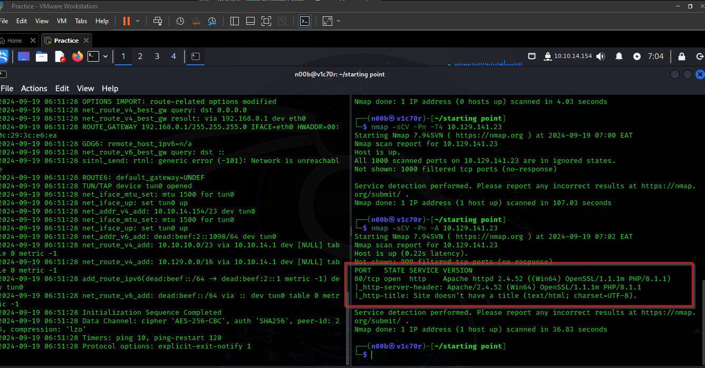

# Introduction


## Task 1

When visiting the web service using the IP address, what is the domain that we are being redirected to?

First we had to scan the IP for open ports only to find port was open as shown below.



on visiting the web page, we are directed to the following domain.


unika.htb

In order to be able to access the webpage on our machine, we are required to add it to the 

```jsx
etc/hosts directory
```


and now we are able to see the page.


## Task 2

Which scripting language is being used on the server to generate webpages?


PHP

## Task 3

What is the name of the URL parameter which is used to load different language versions of the webpage?


page

## Task 4

Which of the following values for the `page` parameter would be an example of exploiting a Local File Include (LFI) vulnerability: "french.html", "[//10.10.14.6/somefile](https://10.10.14.6/somefile)", "../../../../../../../../windows/system32/drivers/etc/hosts", "minikatz.exe"


../../../../../../../../windows/system32/drivers/etc/hosts

## Task 5

Which of the following values for the `page` parameter would be an example of exploiting a Remote File Include (RFI) vulnerability: "french.html", "[//10.10.14.6/somefile](https://10.10.14.6/somefile)", "../../../../../../../../windows/system32/drivers/etc/hosts", "minikatz.exe"


[//10.10.14.6/somefile](https://10.10.14.6/somefile)

## Task 6

What does NTLM stand for?


New Technology LAN Manager

## Task 7

Which flag do we use in the Responder utility to specify the network interface?


-I

## Task 8

There are several tools that take a NetNTLMv2 challenge/response and try millions of passwords to see if any of them generate the same response. One such tool is often referred to as `john`, but the full name is what?.


John The Ripper

## Task 9

What is the password for the administrator user?

For this section, we had to serve a file and set responder ready to catch a credential when the web-server tries to access the file from our machine by exploiting remote file inclusion vulnerability as shown below


the file we were serving is called somefile that contains nothing at all


After a while  when the web server was trying to access the file from our machine, responder caught some credentials of which seems to be of an admin.


Now next we shall try to crack the admin hash to get the password for the admin using john the ripper.


After cracking it, we got the password, as seen below.


badminton

## Task 10

We'll use a Windows service (i.e. running on the box) to remotely access the Responder machine using the password we recovered. What port TCP does it listen on?

Here we are required to do further enumeration to get the other port that is open 


5985

From the port above, it is clear that we can log in to the machine using evil-winrm to get our root flag.


our flag was under the user mike’s Desktop as shown below

